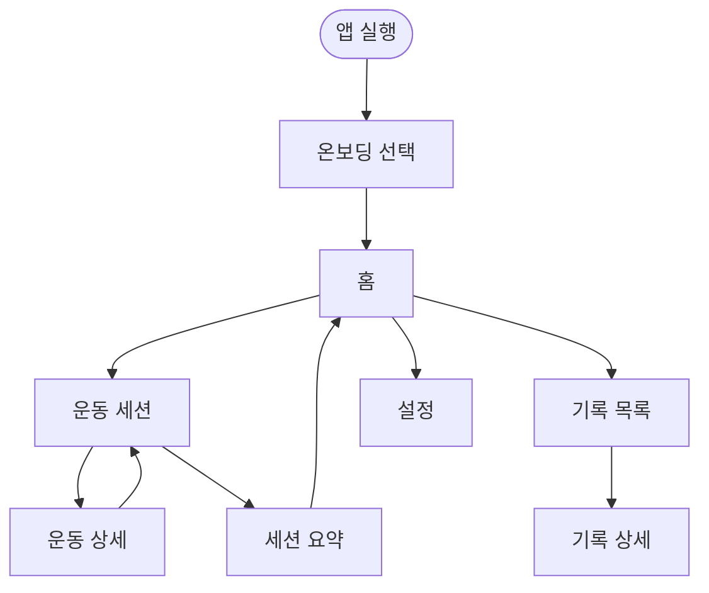

# 화면 구성 및 사용자 플로우 (Flutter)

플랫폼 전제는 **Flutter**이다. 네이밍은 구현 시 조정 가능하나 **역할·정보구조는 유지**한다.

## 디자인 시스템 (다크 모드·헬스장)
- **기본 브라이트니스 다크 테마**(Material Theme `Brightness.dark`).
- 배경과 표면(surface) 레벨을 구분하여 카드 경계가 보이게 한다.
- **숫자(중량·반복·e1RM)**는 본문보다 크게·굵게; WCAG 대비를 가이드로 삼는다.
- 장갑·대각선 시야를 고려해 **FAB·리스트 행·스텝퍼** 등 터치 영역 최소 48dp 근처 유지 권장.
- **Motion**은 과도한 애니메이션보다 명확한 상태 변화(저장됨, 오류)를 우선.

## 화면 목록

| 화면 | 목적 |
|------|------|
| 스플래시 / 온보딩 (짧게) | 앱 가치 1문장, 과부하·e1RM 개념 1회 안내(스킵 가능) |
| 홈(대시보드) | 오늘/최근 요약, **운동 시작** CTA |
| 운동 세션(진행) | 세션 내 운동·세트 입력, 직전 세션 힌트 |
| 운동 상세(세션 중) | 한 운동 집중: 세트 리스트, 과부하 상태 |
| 세션 요약 | 세션 종료 후 과부하·e1RM 요약 |
| 기록 목록 | 과거 세션 리스트 |
| 기록 상세 | 특정 세션 상세 조회(편집 없음) |
| 설정 | 테마(선택: 라이트 토글은 Could), 데이터 안내, 앱 정보 |

초기 단계에는 **로그인 화면 없음**. 동기화 메뉴도 없다(대신 “로컬 저장” 안내).

## 주요 사용자 플로우

### 플로우 A: 첫 실행 → 기록
1. 앱 실행 → 짧은 온보딩(스킵 가능) → **홈**.
2. **운동 시작** → **운동 세션** 화면.
3. 운동 추가 → 이름 입력/선택 → **운동 상세**에서 세트(중량, 반복) 입력.
4. 해당 운동에 직전 세션이 있으면 **직전 세션 요약** 표시.
5. **세션 종료** → **세션 요약**(과부하, e1RM).

### 플로우 B: 운동 중 과부하 확인
1. 운동 상세에서 로컬 로직으로 직전 세션과 비교.
2. 배지 또는 한 줄 문구(예: “반복 증가”, “유지”).
3. 세션 요약에서 운동별 집계.

### 플로우 C: 과거 기록 조회
1. 탭 **기록** → 날짜별 세션 → **기록 상세**.
2. 설정에서 “데이터는 이 기기에만 저장된다” 재확인.

## 네비게이션 제안 (`go_router` 등)
- 루트 탭 3개: **홈** | **기록** | **설정**.
- 운동 세션 · 운동 상세 · 세션 요약은 **별도 라우트 스택**(또는 nested navigator)으로 쌓는다.

## 화면별 필수 UI 요소

### 홈
- 오늘 날짜, 최근 세션 요약(없으면 안내).
- **운동 시작** CTA.
- 최근 운동별 e1RM 스냅샷(카드 개수 제한 가능).

### 운동 세션·운동 상세·세션 요약
- `02-mvp-scope.md` Phase A 기능과 동일한 정보 밀도 유지.

## 플로우 다이어그램

## 접근성
- 시스템 **텍스트 스케일**이 커져도 깨지지 않도록 숫자·버튼에 `FittedBox`/`LayoutBuilder` 등 고려.
