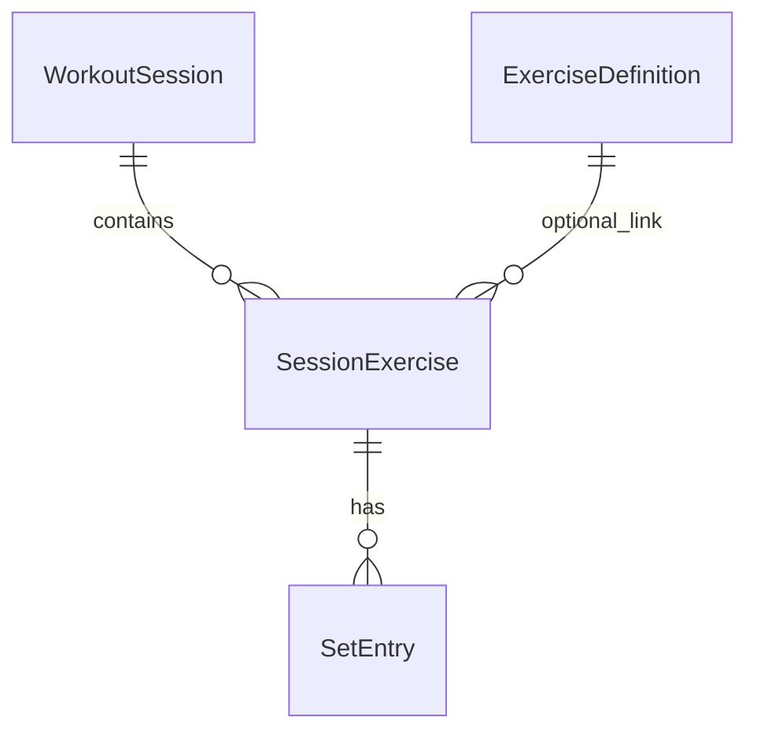

# 데이터 모델 (로컬 전용 MVP)

**단일 기기·단일 사용자** 전제이다. 로그인 없이 모든 데이터가 **SQLite(drift)·Hive 등 로컬 저장소**에만 존재한다. ID는 **UUID 문자열**(또는 시간 기반 로컬 ID) 사용을 권장한다.

## 엔티티 관계 (요약)

- **WorkoutSession** 1 — N **SessionExercise**
- **SessionExercise** 1 — N **SetEntry**
- **ExerciseDefinition** (선택): 이름 정규화·프리셋 목록용

단일 디바이스 앱에서는 **User 테이블이 없거나**, 향후 확장만을 위해 `userId='local'` 상수 FK를 피하고 **세션 테이블이 루트**가 되도록 한다.

## 엔티티 필드

### WorkoutSession

| 필드 | 타입 | 설명 |
|------|------|------|
| id | String (UUID) | PK |
| startedAt | DateTime (ISO8601)·UTC 권장 | 세션 시작 |
| endedAt | DateTime? | 종료 전 null |
| note | String? | 메모(짧게) |
| createdAt | DateTime | 생성 |
| updatedAt | DateTime | 수정 |

### SessionExercise

한 세션에서의 **한 줄 운동**(예: “벤치프레스”). 다른 날이면 새 `SessionExercise` 행.

| 필드 | 타입 | 설명 |
|------|------|------|
| id | String (UUID) | PK |
| sessionId | String | FK → WorkoutSession |
| exerciseDefinitionId | String? | FK → ExerciseDefinition |
| name | String | 표시명 |
| orderIndex | int | 세션 내 순서 |

### SetEntry

| 필드 | 타입 | 설명 |
|------|------|------|
| id | String (UUID) | PK |
| sessionExerciseId | String | FK → SessionExercise |
| orderIndex | int | 세트 순서 |
| weightKg | double | MVP는 kg 고정(`01-requirements.md`에서 lb 확장 가능) |
| reps | int | |
| completed | bool | 기본 true |

### ExerciseDefinition (선택)

| 필드 | 타입 | 설명 |
|------|------|------|
| id | String | PK |
| name | String | 표시명 |
| slug | String | 정규화 키(소문자·공백 제거 등) |

## 파생 규칙

### 세트별 예상 1RM (Epley)

\[
\text{e1RM} = \text{weightKg} \times \left(1 + \frac{\text{reps}}{30}\right)
\]

- **SessionExercise당 대표 e1RM**: 해당 운동의 **완료된 세트**들에 대해 e1RM을 각각 계산한 뒤 **최댓값**을 이번 세션의 해당 운동 점수로 쓴다.

### 직전 세션 정의

- 동일 운동 인식: `exerciseDefinitionId`가 같으면 동일. 없으면 **name 정규화**(소문자, 연속 공백 제거) 동일로 본다.
- **직전 SessionExercise**: 해당 식별로 **이미 종료된** 과거 세션들 중 현재 세션 `startedAt`보다 과거이며 **가장 가까운 세션**에 속하는 운동 행.

### 점진적 과부하(중량·반복 우선)

구현 모듈 예: `lib/domain/progressive_overload.dart`(경로 예시).

1. 비교 세트 선택: 해당 운동에서 **가장 높은 weightKg**(동률이면 **reps가 큰** 세트).
2. 직전 세션도 동일 규칙.
3. 판정: 중량 증가 **또는** 동일 중량에 반복 증가 → **progress**; 중량·반복 동일 → **maintain**; 그 외 → **regress** 또는 데이터 부족 시 **unknown**.

## 인덱스·쿼리 힌트

- `WorkoutSession(startedAt DESC)`
- `SessionExercise(sessionId, orderIndex)`
- 직전 운동 조회: session–exercise 조인 후 exercise 키 + `startedAt` 조건(drift에서는 쿼리 또는 앱 레이어 재귀 근사).

## 향후 확장(문서만)

멀티디바이스·클라우드 단계에서는 **User** 엔티티·`syncVersion`·충돌 정책을 추가하고, 현재 스키마는 **마이그레이션**으로 확장 가능하게 유지한다.
