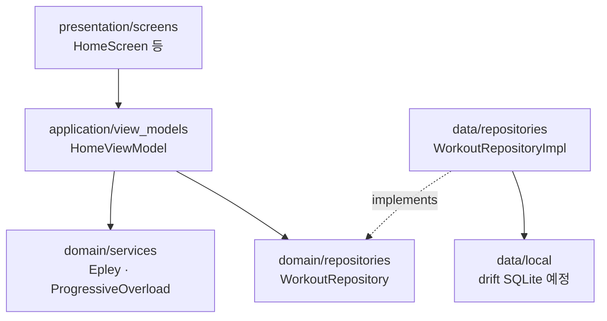

# Architecture

## 선택 패턴

**Layered Architecture + MVVM** (11주차 `02-architecture-patterns.md` 권장)

- **Layered**: Presentation → Application → Domain ← Data
- **MVVM**: Screen(View) ↔ ViewModel ↔ Domain Service / Repository

## 다이어그램

## ADR 연계

| ADR | 내용 |
|-----|------|
| ADR-0001 | Flutter |
| ADR-0002 | 로컬 DB (drift/SQLite 예정) |
| ADR-0003 | Epley e1RM |

## 새 기능 추가 시 위치

| 질문 | 넣을 곳 |
|------|---------|
| 새 화면? | `presentation/screens/` |
| 버튼·카드 UI? | `presentation/widgets/` |
| 화면 상태·로직? | `application/view_models/` |
| 계산 규칙? | `domain/services/` |
| DB 읽기/쓰기? | `data/repositories/` + `data/local/` |

## 테스트 전략

- `domain/services/*`: 단위 테스트 (Epley, 과부하)
- `test/widget_test.dart`: 홈 화면 스모크 테스트
- Repository: drift 연동 후 통합 테스트 추가
